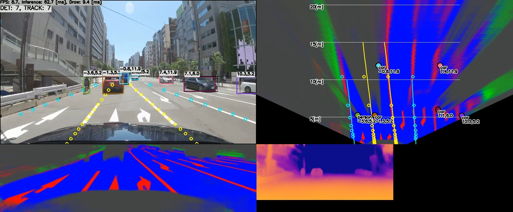
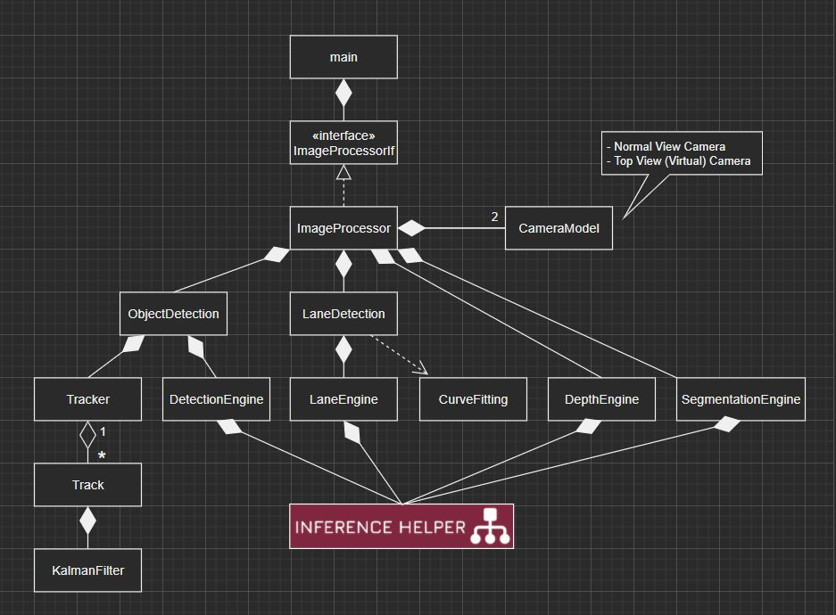
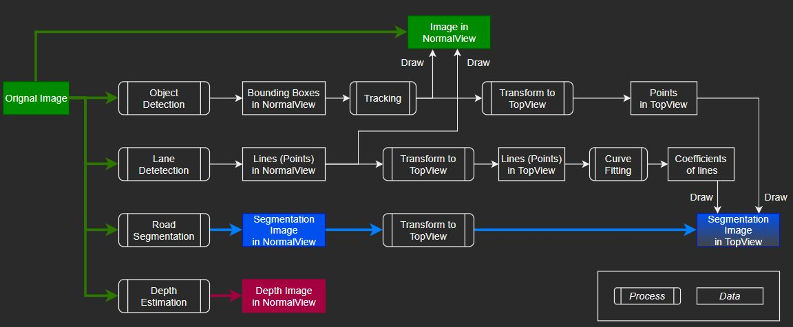

# Self-Driving-ish Computer Vision System

https://user-images.githubusercontent.com/11009876/132947317-3c839522-b347-4a8d-8675-3999adf9cdb6.mp4

- This project generates images you've probably seen in autonomous driving demo
- Detection
    - Object Detection and Tracking
    - Lane Detection and Curve Fitting
    - Road Segmentation
    - Depth Estimation (enabled with TensorRT only)
- Transform using Projective Geometry and Pinhole Camera Model
    - Normal View -> Top View
    - Distance Calculation (image plane -> ground plane in world coordinate system)

## Result
- YoutTube: https://youtu.be/GB4p_fjQZNE




# Tested Environment
## Computer
- Windows 10 (x64) + Visual Studio 2019
    - Intel Core i7-6700 @ 3.4GHz + NVIDIA GeForce GTX 1070
- Jetson Xavier NX. JetPack 4.6

## Deep Learning Inference Framework
- TensorFlow Lite with XNNPACK delegate
    - CPU
    - Running with CPU is very slow
- TensorRT
    - GPU

# How to Build and Run
## Requirements
- OpenCV 4.x
- CMake
- (TensorRT 8.0.x)

## Download 
- Get source code
    ```sh
    git clone https://github.com/iwatake2222/self-driving-ish_computer_vision_system.git
    cd self-driving-ish_computer_vision_system
    git submodule update --init --recursive --recommend-shallow --depth 1
    cd inference_helper/third_party/tensorflow
    chmod +x tensorflow/lite/tools/make/download_dependencies.sh
    tensorflow/lite/tools/make/download_dependencies.sh
    ```
- Download prebuilt library
    - Download prebuilt libraries (third_party.zip) from https://github.com/iwatake2222/InferenceHelper/releases/
    - Extract it to `inference_helper/third_party/`
- Download models
    - Download models (resource.zip) from https://github.com/iwatake2222/self-driving-ish_computer_vision_system/releases/
    - Extract it to `resource/`

## Windows (Visual Studio)
- Configure and Generate a new project using cmake-gui for Visual Studio 2019 64-bit
    - `Where is the source code` : path-to-cloned-folder
    - `Where to build the binaries` : path-to-build	(any)
- Open `main.sln`
- Set `main` project as a startup project, then build and run!
- Note:
    - Running with `Debug` causes exception, so use `Release` or `RelWithDebInfo` if you use TensorFlow Lite
    - You may need to modify cmake setting for TensorRT for your environment

## Linux (Jetson Xavier NX)
```sh
mkdir build && cd build
# cmake .. -DENABLE_TENSORRT=off
cmake .. -DENABLE_TENSORRT=on
make
./main
```

## cmake options
```sh
cmake .. -DENABLE_TENSORRT=off  # Use TensorFlow Lite (default)
cmake .. -DENABLE_TENSORRT=on   # Use TensorRT

cmake .. -DENABLE_SEGMENTATION=on    # Enable Road Segmentation function (default)
cmake .. -DENABLE_SEGMENTATION=off   # Disable Road Segmentation function

cmake .. -DENABLE_DEPTH=on    # Enable Depth Estimation function (default)
cmake .. -DENABLE_DEPTH=off   # Disable Depth Estimation function
```

## Usage
```
./main [input]
 - input:
    - use the default image file set in source code (main.cpp): blank
        - ./main
     - use video file: *.mp4, *.avi, *.webm
        - ./main test.mp4
     - use image file: *.jpg, *.png, *.bmp
        - ./main test.jpg
    - use camera: number (e.g. 0, 1, 2, ...)
        - ./main 0
    - use camera via gstreamer on Jetson: jetson
        - ./main jetson
```

## Control
- Mouse Drag: Change top view angle
- Keyboard (asdwzx) : Change top view position


## Note
It will take around 10 - 20 minutes when you execute the app for the first time, due to model conversion

# Software Design
## Class Diagram


## Data Flow Diagram



# Model Information
## Details
- Object Detection
    - YOLOX-Nano, 480x640
    - https://github.com/PINTO0309/PINTO_model_zoo/blob/main/132_YOLOX/download_nano_new.sh
    - https://github.com/PINTO0309/PINTO_model_zoo/blob/main/132_YOLOX/download_nano.sh
- Lane Detection
    - Ultra-Fast-Lane-Detection, 288x800
    - https://github.com/PINTO0309/PINTO_model_zoo/blob/main/140_Ultra-Fast-Lane-Detection/download_culane.sh
- Road Segmentation
    - road-segmentation-adas-0001, 512x896
    - https://github.com/PINTO0309/PINTO_model_zoo/blob/main/136_road-segmentation-adas-0001/download.sh
- Depth Estimation
    - LapDepth, 192x320
    - https://github.com/PINTO0309/PINTO_model_zoo/blob/main/149_depth_estimation/download.sh
    - LapDepth, 256x512
    - [00_doc/pytorch_pkl_2_onnx_LapDepth.ipynb](00_doc/pytorch_pkl_2_onnx_LapDepth.ipynb)

## Performance
| Model                            | Jetson Xavier NX | GTX 1070 |
| -------------------------------- | ---------------: | -------: |
| == Inference time ==                                           |
|  Object Detection                |          10.6 ms |   6.4 ms |
|  Lane Detection                  |           9.6 ms |   4.9 ms |
|  Road Segmentation               |          29.1 ms |  13.5 ms |
|  Depth Estimation                |          55.2 ms |  37.8 ms |
| == FPS ==                                                      |
|  Total (All functions)           |          6.8 fps | 10.9 fps |
|  Total (w/o Segmentation, Depth) |         24.4 fps | 33.3 fps |

* Input
    - Jetson Xavier NX: Camera
    - GTX 1070: mp4 video
* With TensorRT FP16
* "Total" includes image read, pre/post process, other image process, result image drawing, etc.

# License
- Copyright 2021 iwatake2222
- Licensed under the Apache License, Version 2.0
    - [LICENSE](LICENSE)


# Acknowledgements
I utilized the following OSS in this project. I appreciate your great works, thank you very much.

## Code, Library
- TensorFlow
    - https://github.com/tensorflow/tensorflow
    - Copyright 2019 The TensorFlow Authors
    - Licensed under the Apache License, Version 2.0
    - Generated pre-built library
- TensorRT
    - https://github.com/nvidia/TensorRT
    - Copyright 2020 NVIDIA Corporation
    - Licensed under the Apache License, Version 2.0
    - Copied source code
- cvui
    - https://github.com/Dovyski/cvui
    - Copyright (c) 2016 Fernando Bevilacqua
    - Licensed under the MIT License (MIT)
    - Copied source code

## Model
- PINTO_model_zoo
    - https://github.com/PINTO0309/PINTO_model_zoo
    - Copyright (c) 2019 Katsuya Hyodo
    - Licensed under the MIT License (MIT)
    - Copied converted model files
- YOLOX
    - https://github.com/Megvii-BaseDetection/YOLOX
    - Copyright (c) Megvii, Inc. and its affiliates. All Rights Reserved
    - Licensed under the Apache License, Version 2.0
- Ultra-Fast-Lane-Detection
    - https://github.com/cfzd/Ultra-Fast-Lane-Detection
    - Copyright (c) 2020 cfzd
    - Licensed under the MIT License (MIT)
- road-segmentation-adas-0001
    - https://github.com/openvinotoolkit/open_model_zoo/tree/master/models/intel/road-segmentation-adas-0001
    - Copyright (c) 2021 Intel Corporation
    - Licensed under the Apache License, Version 2.0
- LapDepth-release
    - https://github.com/tjqansthd/LapDepth-release
    - Licensed under the GNU General Public License v3.0

## Image Files
- OpenCV
    - https://github.com/opencv/opencv
    - Licensed under the Apache License, Version 2.0
- YoutTube
    - https://www.youtube.com/watch?v=tTuUjnISt9s
    - Licensed under the Creative Commons license
    - Copyright Dashcam Roadshow 2020
